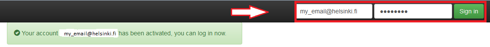

# Activating your Pouta Blueprints account

The first time using the course environment, it is necessary to activate your Pouta Blueprints account and create your password. 
This needs to be done only once when the course starts.
**Note**: If you already have activated your account you can continue with [launching a new computer instance](launch-instance.md).

To activate your account, follow these steps:

 1. **Follow the activation link that was sent to you by the course lecturer** (example): 
 

 
 2. **Create a password for your account** (Be sure to remember this, you will need it frequently)
 

 
 3. **Log into the Pouta Blueprint dashboard**
 

 
 4. **Create your SSH keys**
 

 
 5. **Log out**
 

After completing these steps you will be done with activating your account and can continue with **[launching your first Computer Instance](launch-instance.md)**.
