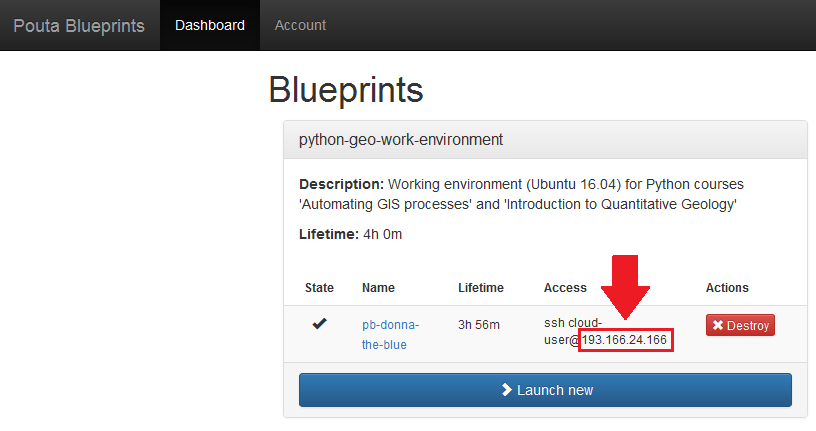
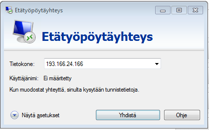

# Connect to the computer instance

There are basically two steps that you need to do for being able to connect to a remote (cloud) computer instance: 1) find out the 
IP address of the (running) computer instance and 2) connect to it with Remote Desktop software at your local computer. 

There are slightly different ways of accessing the cloud computer instance that is depending on:
 
 - the operating system that you have on your local computer (Windows / Mac / Linux) 
 - Remote Desktop software (or protocol) that you are using
 
Below are instructions how to access the computer instance on different systems (follow the one that you have). 

## 1. Copy the IP address of your computer instance

This step is common for all operating systems.
 
You can find the IP address from the Computing Dashboard under the **'Access'** column. Copy and paste only the numbers. 
We won't be needing the rest of the information mentioned there. 
*(They are used for taking a specific SSH connection with command prompt to the computer).*   

 

## 2A Connect to computer instance on Windows

On Windows we introduce two different softwares that can be used for connecting the remote computer, namely **'TightVNC Viewer'** and a 
**'Remote Desktop Connection'** -tool (in finnish 'Etätyöpöytäyhteys'). [TightVNC Viewer](http://www.tightvnc.com/) is freely available 
and open source remote desktop software that has some nice features and is smooth to use. We will be using this tool in the GIS labs 
where they are installed on the computers. If you want, you can also [download](http://www.tightvnc.com/download.php) and install 
this tool to your own computer. 

[Remote Desktop Connection](https://support.microsoft.com/en-us/help/17463/windows-7-connect-to-another-computer-remote-desktop-connection) -tool is 
another remote desktop software that comes with every Windows computer. It is more simple but has slightly 'un-smoothier' user experience when in use 
compared to TightVNC. However, it is highly recommendable option since it can be used from any Windows computer 
(e.g. from the computers in the University's libraries or your own Windows computer) without any additional installation.  
  
**Connecting with TightVNC Viewer -software**
    
  - add docs
  
**Connecting with Remote Desktop Connection -tool**

 1. Start the tool by clicking the Windows Start button and searching it with word 'Etätyöpöytäyhteys' (or 'Remote Desktop Connection' in english)
  
  
  
 2. Paste the IP address of your computer instance that you copied in the previous step (2.1) and press 'Yhdistä' (eng. 'Connect')
  
  
  
 3. Log into the computer instance by pressing OK.
 
  
 
 4. That's it! You're inside the remote computer and ready to roll. 
 
  

## 2B Connect to computer instance on Mac / Linux
  
  - Add docs here 