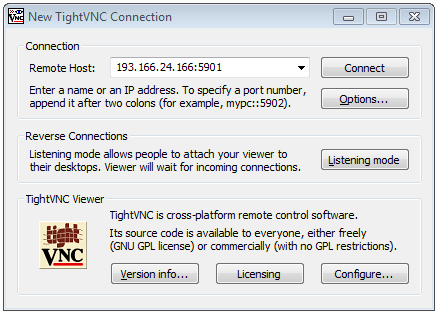

# Windows: Connect to remote Computer Instance with TightVNC -software
 
1. Start the tool by clicking the Windows Start button and searching it with word 'TightVNC'

 
  
2. Paste the `IP address` of your computer instance that you copied in the [previous step](connect-to-instance.md#CopyIP) and add a port number `5901` 
after the IP address separated with colon so that it will look like `xxx.xxx.xx.xxx:5901`

 

3. Fill in the password `geoman`, and  press `Connect`
 
 

4. That's it! You're inside the remote computer and ready to roll. 
 
  