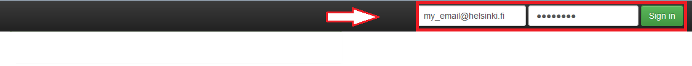
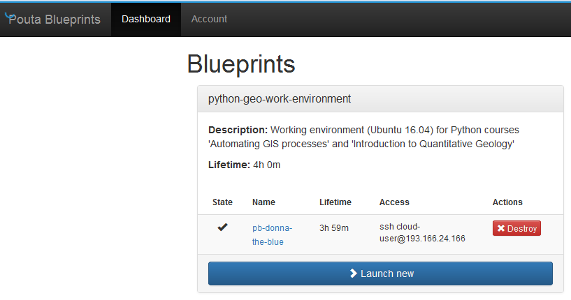

# 1. Launch a new computer instance

Launching a new instance is a straightforward procedure which is done from the Computing Dashboard. 
Here we first launch a new Computer Instance and then open a port to it from your local computer's IP address (steps 5-6).
A port in a computer is a somewhat similar idea than 
having a door in a house: you cannot access the house without having an open door.

 1. Go with a browser to **[pb.geo.helsinki.fi](pb.geo.helsinki.fi)** 
 
 2. **Sign in to the Computing Dashboard**
 
   
 
 3. **`Launch new` computer instance**
 
    
 
 4. Wait until instance is ready (you'll see WHAT?) and 
 **go to instance details by pressing it's name** 
 (here 'pb-donna-the-blue' but it changes every time)
 
   
  
 5. **Press `Query client IP` button**
 
   
    
 6. **Press `Change client IP` button**
 
   
 
 7. **Go back to Dashboard tab**
 
   
     
Next step is to **[connect to it](connect-to-instance.md)**.