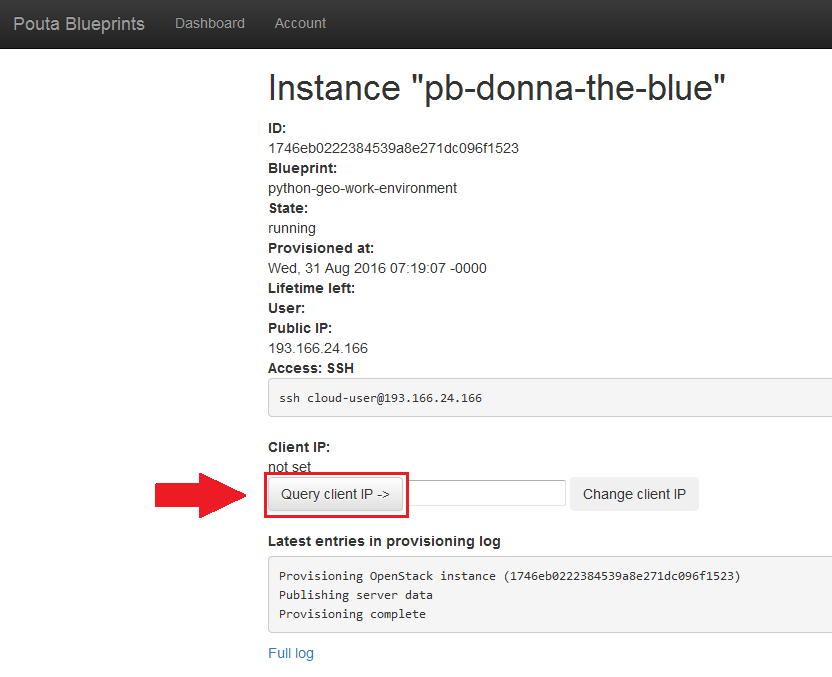
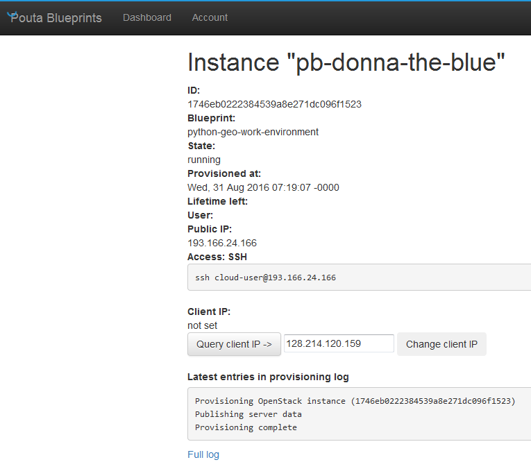
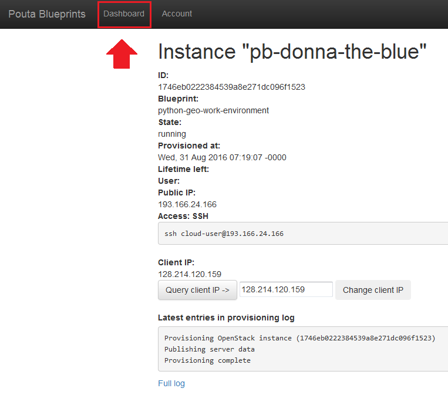

# 1. Launch a new computer instance

Launching a new instance is a straightforward procedure which is done from the Computing Dashboard. 
Here we first launch a new Computer Instance and then open a port to it from your local computer's IP address (steps 5-6).
A port in a computer is a somewhat similar idea than 
having a door in a house: you cannot access the house without having an open door.

 1. Go with a browser to [pb-geo.helsinki.fi](pb-geo.helsinki.fi) OR WHATEVER THE ADDRESS WILL BE!
 
 2. Login to the Computing Dashboard
 
   
 
 3. `Launch new` computer instance
 
   
 
 4. Wait until instance is ready (you'll see WHAT?) and 
 go to instance details by pressing it's name 
 (here 'pb-donna-the-blue' but it changes every time)
 
   
  
 5. Press `Query client IP` button
 
   
 
 6. Press `Change client IP` button
 
   
 
 7. Go back to Dashboard tab
 
   
  
Next step is to **[connect to it](connect-to-instance.md)**.